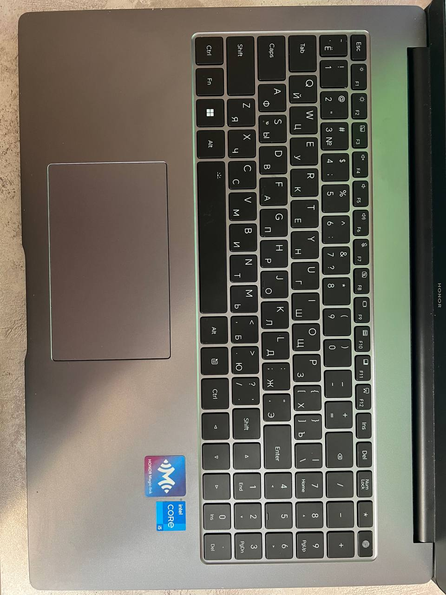
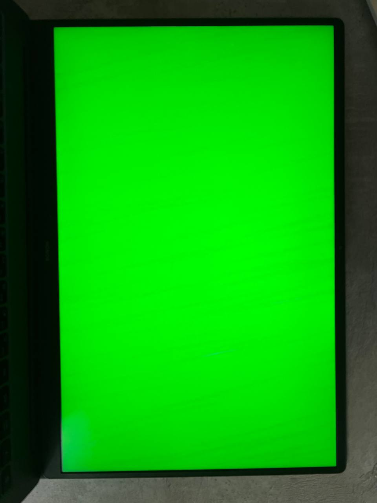
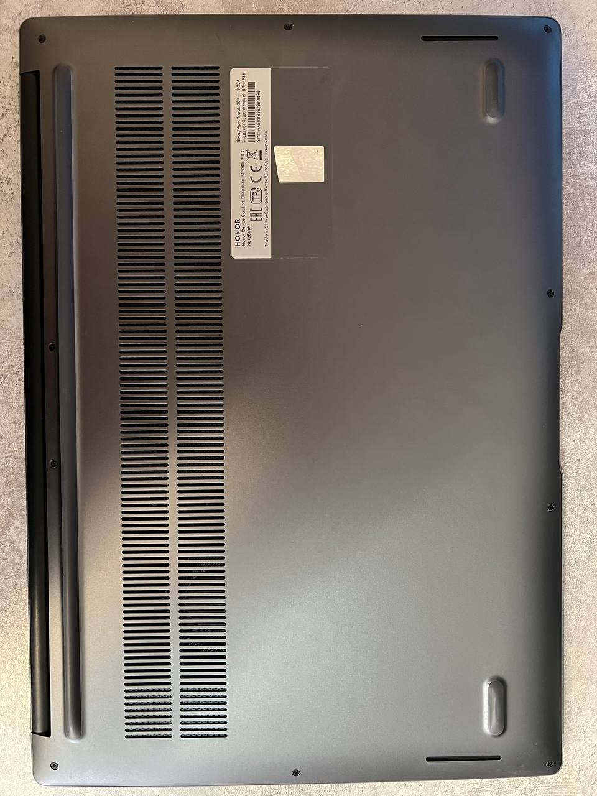
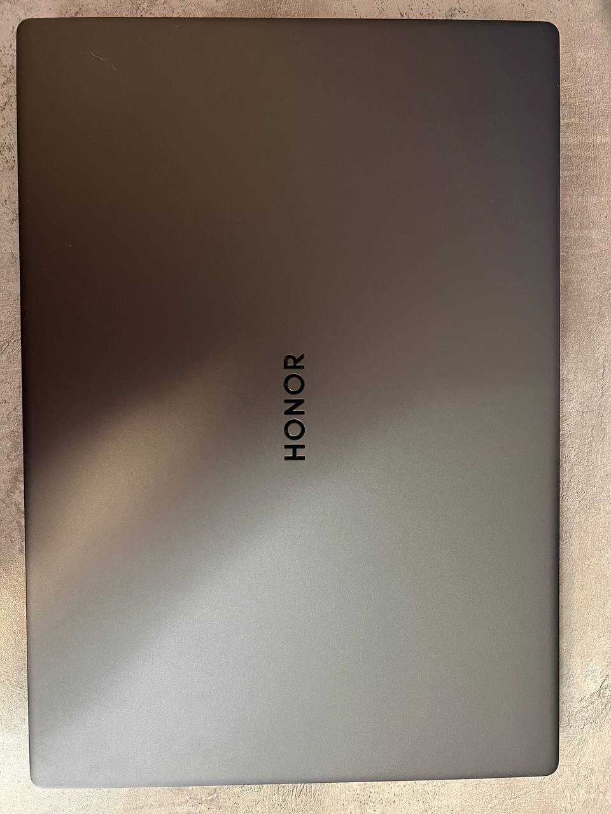
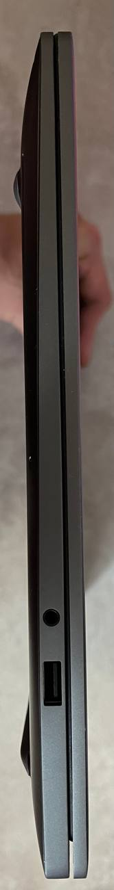
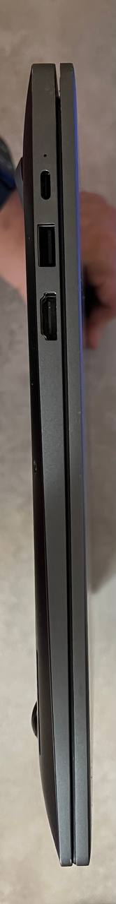

<p align="center">
     <H2 align="center">Команда Neutral Hub</H2> 
    <H2 align="center">Определение дефектов на ноутбуках</H2> 
</p>

## Описание решения


## Особенности


## Используемые технологии

Интерфейс: React, Material UI

Серверная часть: Flask

База данных: PostgreSQL

Контейнеризация: Docker, Docker Compose

## Запуск проекта

Для запуска проекта требуется требуется:

*1. Установить Docker Desktop с оффициального сайта.*

*2. Для запуска всего приложения в папке `/ProcurementMaterialAPI` требуется выполнить следующую команду:*

```cmd
docker-compose up --build
```

После установки всех библиотек и зависимостей будет созданно 3 docker контейнера:
- _frontend_ - с frontend частью проекта на порту 3000
- _api_ - с API на порту 8080
- _mssql_ - база данных MsSQL на порту 1433

*3. После требуется выполнить миграцию базы данных следующей командой:*

```cmd
dotnet ef database update --connection "Server=localhost,1433;Database=Materials;User=sa;Password=Passw0rd;TrustServerCertificate=True;"
```

## Руководство по фотографированию ноутбуков для более эффективного обнаружения дефектов

Для повышения эффективности обнаружения дефектов на ноутбуках рекомендуется следовать ряду правил при создании фотографий. Качественные изображения помогут значительно улучшить точность распознавания и классификации дефектов. Примеры оптимальных ракурсов:

<div style="display: flex; flex-wrap: wrap; gap: 10px;">
    
    
    
    
    <div>
     
    
    </div>
</div>


Следование этим рекомендациям обеспечит более эффектичвное распознавание дефектов на ноутбуке системой анализа.


### Пример работы нашего приложения вы можете увидеть на данном видео.

https://github.com/Fresh-vano/ProcurementMaterial/assets/74467916/9369635e-aad1-4a9d-8795-1c26e6a5a35c
